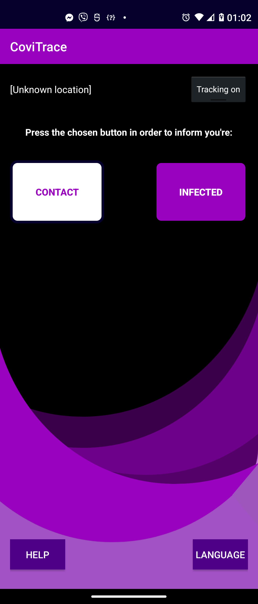
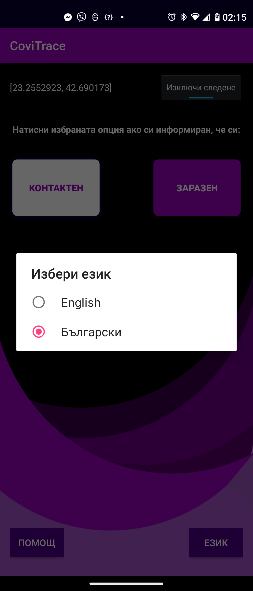
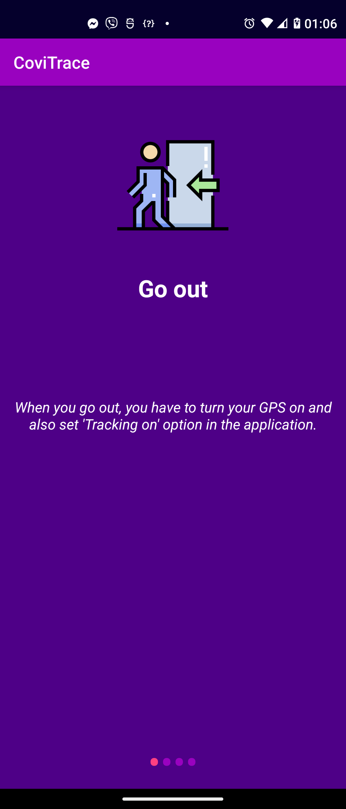
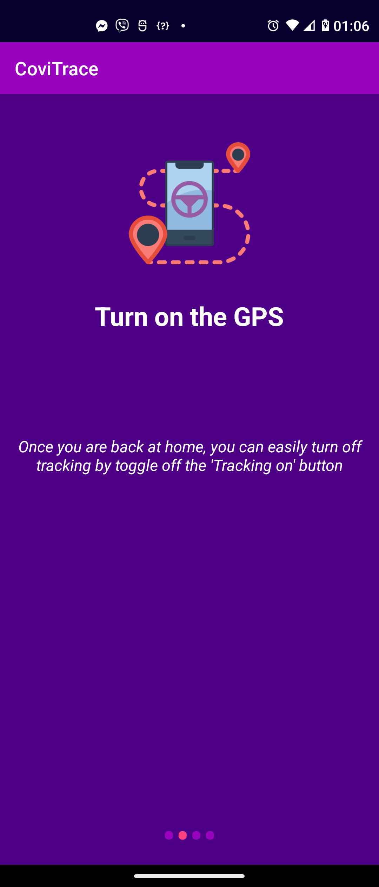
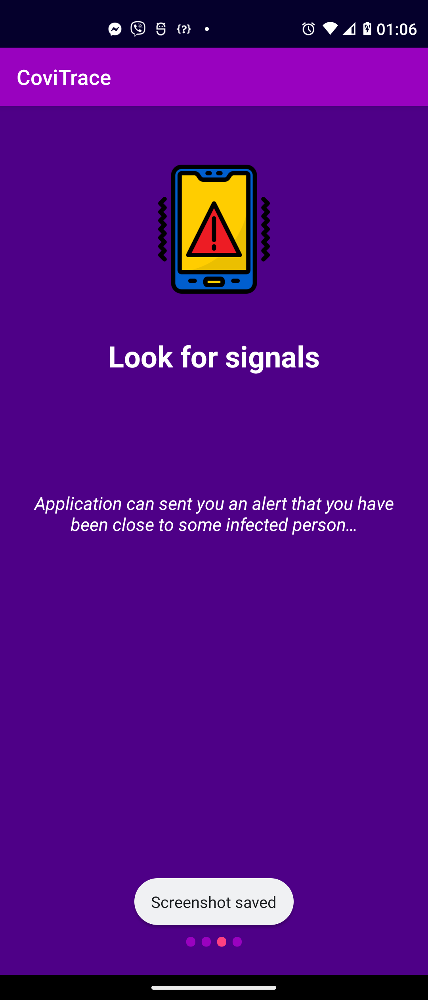
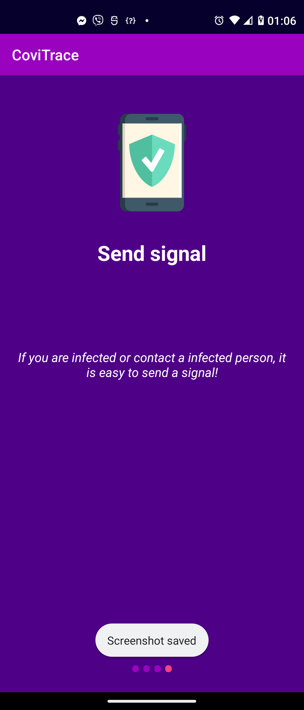

## CoviTrace Android Application

### Short description

CoviTrace mobile client.

### Workflows

#### Default screen

This is the default state after you open the application. The two action buttons "Contact" and "Infected" are displayed. Clicking either of them would change your current status to either infected or contacted.

#### Chnage language (EN or BG)

Choose between EN or BG to be used as application language.

#### Tracking location

Click on "Tracking on" toggle button in order to start sending current location to the API.

#### Help

Displays help instructions on how to use the app.

   
